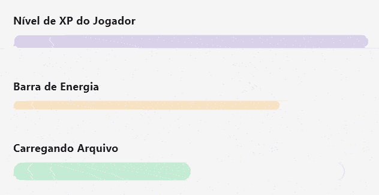

In many applications, we need a visual way to show the progress of a task, whether it's loading a file, advancing a level in a game, or the steps in a form. I recently came across this need and decided to create my own progress bar widget in Flutter.

In this post, I'll share the process of creating a `CustomProgressBar`, a reusable, animated, and easy-to-use widget. And best of all, the code is available in a public repository for anyone to use!

### The Initial Idea

The first idea was simple: use two `Container`s, one on top of the other. The bottom one would be the background of the bar, and the top one, with a different color, would have its width changed to represent the progress. To add a more professional touch, the transition needed to be smooth. That's where `AnimatedContainer` came into play.

### Building the `CustomProgressBar` Widget

After a few iterations, I arrived at a clean and efficient final version. The widget receives the width, height, progress value (from 0 to 100), and a main color. The background color is automatically generated with a lower opacity, ensuring a cohesive design.

Here's the final widget code:

```dart
import 'package:flutter/material.dart';

class CustomProgressBar extends StatelessWidget {
  final double width;
  final double height;
  final double value;
  final Color color;

  const CustomProgressBar({
    super.key,
    required this.width,
    required this.height,
    required this.value,
    required this.color,
  });

  @override
  Widget build(BuildContext context) {
    final double clampedValue = value.clamp(0.0, 100.0);
    final BorderRadius borderRadius = BorderRadius.circular(height / 2);
    final Color backgroundColor = color.withAlpha((255 * 0.2).round());

    return Stack(
      children: [
        Container(
          width: width,
          height: height,
          decoration: BoxDecoration(
            color: backgroundColor,
            borderRadius: borderRadius,
          ),
        ),
        AnimatedContainer(
          duration: const Duration(milliseconds: 50),
          curve: Curves.linear,
          width: width * (clampedValue / 100),
          height: height,
          decoration: BoxDecoration(
            color: color,
            borderRadius: borderRadius,
          ),
        ),
      ],
    );
  }
}
```

### The Linear Animation Challenge

An interesting challenge arose when trying to create a continuous loading animation. Using a `Timer` to update the value every few milliseconds caused a strange acceleration at the end of the animation. The solution was to use the right tool for the job: an `AnimationController`. It's perfect for time-based animations, ensuring a perfectly linear movement from start to finish.

### The Final Result

To demonstrate the widget, I created an example page that displays several progress bars with different sizes and colors.



### Conclusion and Source Code

Creating custom components in Flutter is a rewarding task. With just a few lines of code, we achieved an elegant, animated, and reusable progress bar widget.

If you liked it and want to use this widget in your project, or simply explore the code, the complete repository is available on GitHub.

**[Access the repository on GitHub here!](https://github.com/thomazrb/flutter_custom_progress_bar)**

Feel free to open issues, send pull requests, or just give it a star if you find it useful!
