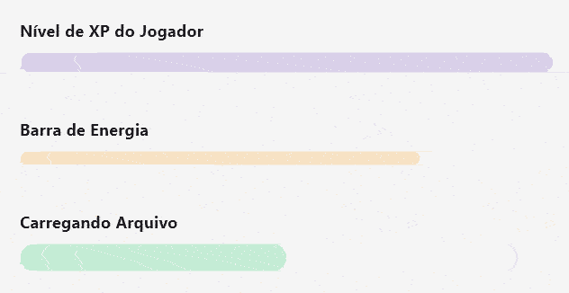

Em muitos aplicativos, precisamos de uma forma visual para mostrar o progresso de uma tarefa, seja o carregamento de um arquivo, o avanço de um nível em um jogo ou os passos de um formulário. Recentemente, me deparei com essa necessidade e decidi criar meu próprio widget de barra de progresso no Flutter.

Neste post, vou compartilhar o processo de criação de um `CustomProgressBar`, um widget reutilizável, animado e fácil de usar. E o melhor de tudo, o código está disponível em um repositório público para quem quiser usar!

### A Ideia Inicial

A primeira ideia foi simples: usar dois `Container`s um sobre o outro. O de baixo seria o fundo da barra, e o de cima, com uma cor diferente, teria sua largura alterada para representar o progresso. Para dar um toque mais profissional, a transição precisava ser suave. Foi aí que o `AnimatedContainer` entrou em cena.

### Construindo o Widget `CustomProgressBar`

Depois de algumas iterações, cheguei a uma versão final limpa e eficiente. O widget recebe a largura, a altura, o valor do progresso (de 0 a 100) e uma cor principal. A cor de fundo é gerada automaticamente com uma opacidade mais baixa, garantindo um design coeso.

Aqui está o código final do widget:

```dart
import 'package:flutter/material.dart';

class CustomProgressBar extends StatelessWidget {
  final double width;
  final double height;
  final double value;
  final Color color;

  const CustomProgressBar({
    super.key,
    required this.width,
    required this.height,
    required this.value,
    required this.color,
  });

  @override
  Widget build(BuildContext context) {
    final double clampedValue = value.clamp(0.0, 100.0);
    final BorderRadius borderRadius = BorderRadius.circular(height / 2);
    final Color backgroundColor = color.withAlpha((255 * 0.2).round());

    return Stack(
      children: [
        Container(
          width: width,
          height: height,
          decoration: BoxDecoration(
            color: backgroundColor,
            borderRadius: borderRadius,
          ),
        ),
        AnimatedContainer(
          duration: const Duration(milliseconds: 50),
          curve: Curves.linear,
          width: width * (clampedValue / 100),
          height: height,
          decoration: BoxDecoration(
            color: color,
            borderRadius: borderRadius,
          ),
        ),
      ],
    );
  }
}
```

### O Desafio da Animação Linear

Um desafio interessante surgiu ao tentar criar uma animação de carregamento contínua. Usar um `Timer` para atualizar o valor a cada poucos milissegundos causava uma aceleração estranha no final da animação. A solução foi usar a ferramenta correta para o trabalho: o `AnimationController`. Ele é perfeito para animações baseadas em tempo, garantindo um movimento perfeitamente linear do início ao fim.

### O Resultado Final

Para demonstrar o widget, criei uma página de exemplo que exibe várias barras de progresso com diferentes tamanhos e cores.



### Conclusão e Código Fonte

Criar componentes personalizados no Flutter é uma tarefa gratificante. Com poucas linhas de código, conseguimos um widget de barra de progresso elegante, animado e reutilizável.

Se você gostou e quer usar este widget no seu projeto, ou simplesmente explorar o código, o repositório completo está disponível no GitHub.

**[Acesse o repositório no GitHub aqui!](https://github.com/thomazrb/flutter_custom_progress_bar)**

Sinta-se à vontade para abrir issues, enviar pull requests ou simplesmente dar uma estrela se achar útil!
