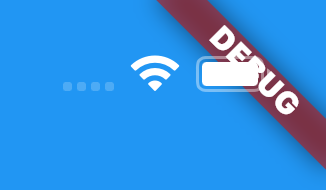

Every Flutter application comes in debug mode by default, which means that the debug banner is shown. It serves only to remind us that the application is in debug mode, and when you switch to release mode, this banner will not be present.

But this banner can be annoying to some people, like me, during the development of the app.

To remove it, simply set the value of the **debugShowCheckedModeBanner** property to **false** in your **MaterialApp**:

```dart
MaterialApp(
    debugShowCheckedModeBanner: false
)
```
For example, in the default template:

```dart
MaterialApp(
      debugShowCheckedModeBanner: false,
      title: 'Flutter Demo',
      theme: ThemeData(
        primarySwatch: Colors.blue,
      ),
      home: const MyHomePage(title: 'Flutter Demo Home Page'),
    );
```
That's it! The debug banner will no longer be shown in your application.

If you prefer a video, I have this content in a Youtube video (speaking in Brazilian Portuguese):

