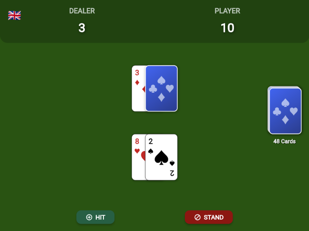

Developing games or apps that simulate board games always brings interesting UI challenges. Recently, while creating a version of the classic card game Blackjack in Flutter, I found myself needing a playing card component that was not only functional but also visually appealing and, above all, reusable.

In this post, I'll guide you through the process of creating `PlayingCard`, a widget that renders both the front and back of a card, is fully customizable in size, and was the centerpiece of my [Blackjack game](https://thomazrb.itch.io/flutter-blackjack).

### The Structure: Separating Data from the UI

Before drawing anything, the most important thing is to model the data. A good architecture separates the logic (what a card *is*) from the presentation (how a card *looks*). For this, I created the `PlayingCardModel` class.

It uses `enum` to ensure that suits and ranks are always valid, and it contains the logic to get the string representation ('A', 'K', '10') and the card's value in the game of Blackjack.

```dart
/// Defines the four possible suits of a deck.
enum CardSuit { hearts, diamonds, clubs, spades }

/// Defines the ranks (values/figures) of a card.
enum CardRank {
  ace, two, three, four, five, six, seven, eight, nine, ten, jack, queen, king,
}

/// Represents the data model for a single playing card.
class PlayingCardModel {
  final CardSuit suit;
  final CardRank rank;
  bool isFaceUp;

  PlayingCardModel({
    required this.suit,
    required this.rank,
    this.isFaceUp = true,
  });

  /// Returns the `String` representation of the card's rank.
  String get rankString {
    switch (rank) {
      case CardRank.ace: return 'A';
      case CardRank.jack: return 'J';
      case CardRank.queen: return 'Q';
      case CardRank.king: return 'K';
      default: return (rank.index + 1).toString();
    }
  }

  /// Returns the numerical value of the card for the game of Blackjack.
  int get value {
    switch (rank) {
      case CardRank.ace: return 11; // Ace is initially 11.
      case CardRank.jack:
      case CardRank.queen:
      case CardRank.king: return 10;
      default: return rank.index + 1;
    }
  }
}
```

### Building the `PlayingCard` Widget

With the model ready, we can focus on the visual part. The `PlayingCard` widget receives a `PlayingCardModel` and a `size` parameter, which acts as a multiplier to scale the entire card, making it incredibly flexible for different layouts.

The main logic is simple: if `card.isFaceUp` is true, show the face; otherwise, show the back.

Here is the complete widget code:

```dart
import 'package:flutter/material.dart';
import 'dart:math' as math;
import '../models/card_model.dart';

class PlayingCard extends StatelessWidget {
  final PlayingCardModel card;
  final double size;

  const PlayingCard({super.key, required this.card, this.size = 1.0});

  // Getter for the suit's visual details (icon and color).
  Map<String, dynamic> get _suitDetails {
    switch (card.suit) {
      case CardSuit.hearts: return {'icon': '♥', 'color': Colors.red[700]!};
      case CardSuit.diamonds: return {'icon': '♦', 'color': Colors.red[700]!};
      case CardSuit.clubs: return {'icon': '♣', 'color': Colors.black};
      case CardSuit.spades: return {'icon': '♠', 'color': Colors.black};
    }
  }

  @override
  Widget build(BuildContext context) {
    return card.isFaceUp ? _buildCardFace() : _buildCardBack();
  }

  /// Builds the widget representing the card's face (rank and suit).
  Widget _buildCardFace() {
    final details = _suitDetails;
    final String rankText = card.rankString;
    final String suitIcon = details['icon'];
    final Color suitColor = details['color'];

    final cardWidth = 70.0 * size;
    final cardHeight = 100.0 * size;
    final cornerFontSize = 16.0 * size;
    final centerFontSize = 35.0 * size;

    return Container(
      width: cardWidth,
      height: cardHeight,
      decoration: BoxDecoration(
        color: Colors.white,
        borderRadius: BorderRadius.circular(8.0 * size),
        border: Border.all(color: Colors.black, width: 0.5 * size),
        boxShadow: [
          BoxShadow(
            color: Colors.black.withAlpha(51), // ~20% opacity
            spreadRadius: 1 * size,
            blurRadius: 3 * size,
            offset: Offset(1 * size, 1 * size),
          ),
        ],
      ),
      child: Stack(
        children: [
          // Top-left corner
          Positioned(
            top: 4 * size,
            left: 5 * size,
            child: _buildCorner(rankText, suitIcon, suitColor, cornerFontSize),
          ),
          // Bottom-right corner (rotated)
          Positioned(
            bottom: 4 * size,
            right: 5 * size,
            child: Transform.rotate(
              angle: math.pi,
              child: _buildCorner(
                rankText,
                suitIcon,
                suitColor,
                cornerFontSize,
              ),
            ),
          ),
          // Center suit icon
          Center(
            child: Text(
              suitIcon,
              style: TextStyle(fontSize: centerFontSize, color: suitColor),
            ),
          ),
        ],
      ),
    );
  }

  /// Builds the widget representing the card's back.
  Widget _buildCardBack() {
    final cardWidth = 70.0 * size;
    final cardHeight = 100.0 * size;

    return Container(
      width: cardWidth,
      height: cardHeight,
      decoration: BoxDecoration(
        color: const Color(0xFF1E3A8A), // Dark blue
        borderRadius: BorderRadius.circular(8.0 * size),
        border: Border.all(color: Colors.white, width: 1.5 * size),
        gradient: LinearGradient(
          colors: [const Color(0xFF2563EB), const Color(0xFF1E3A8A)],
          begin: Alignment.topLeft,
          end: Alignment.bottomRight,
        ),
        boxShadow: [
          BoxShadow(
            color: Colors.black.withAlpha(77), // ~30% opacity
            spreadRadius: 1 * size,
            blurRadius: 4 * size,
            offset: Offset(1 * size, 1 * size),
          ),
        ],
      ),
      child: Center(child: _buildCircularSuitPattern()),
    );
  }

  /// Creates the circular pattern with the 4 suits for the card's back.
  Widget _buildCircularSuitPattern() {
    final suits = ['♥', '♦', '♣', '♠'];
    final radius = 18.0 * size;
    final iconSize = 19.0 * size;

    return Stack(
      alignment: Alignment.center,
      children: List.generate(suits.length, (index) {
        // Calculate the angle for each suit (0, 90, 180, 270 degrees).
        final angle = index * (math.pi / 2);

        // Use trigonometry to calculate the (x, y) position on the circle.
        final x = radius * math.cos(angle);
        final y = radius * math.sin(angle);

        final suitColor = Colors.white.withAlpha(153); // ~60% opacity

        return Transform.translate(
          offset: Offset(x, y),
          child: Text(
            suits[index],
            style: TextStyle(
              fontSize: iconSize,
              color: suitColor,
              fontWeight: FontWeight.bold,
            ),
          ),
        );
      }),
    );
  }

  /// Builds the card's corner widget (rank and suit).
  Widget _buildCorner(String rank, String suit, Color color, double fontSize) {
    return Column(
      children: [
        Text(
          rank,
          style: TextStyle(
            fontSize: fontSize,
            fontWeight: FontWeight.bold,
            color: color,
          ),
        ),
        Text(
          suit,
          style: TextStyle(fontSize: fontSize * 0.8, color: color),
        ),
      ],
    );
  }
}
```

### Visual Implementation Details

Some interesting points in the UI construction:

1.  **Symmetrical Corners**: To create the classic card look with the value on opposite corners, I created a `_buildCorner` widget and, for the bottom-right corner, simply rotated it 180 degrees (`math.pi`) with a `Transform.rotate`. Simple and effective!
2.  **Stylized Back**: Instead of a solid color, I used a `LinearGradient` to give depth to the card's back.
3.  **Trigonometric Suit Pattern**: The coolest detail on the back is the circular pattern with the four suits. Using a `Stack` and a bit of trigonometry (`cos` and `sin`), I positioned each icon in a perfect circle. `List.generate` creates the 4 icons, and `Transform.translate` positions them based on the calculated angle.

### The Result in Action

To see the `PlayingCard` component in a real project, there's nothing better than a functional game. I created a simple web version of Blackjack that demonstrates how the cards are dealt, flipped, and arranged on the screen.



You can play it directly in your browser:

**[Play Flutter Blackjack here!](https://thomazrb.itch.io/flutter-blackjack)**

### Conclusion and Source Code

Creating UI components from scratch in Flutter is an extremely rewarding exercise. With `PlayingCard`, we have a flexible widget with a clean API and a polished look, ready to be used in any card game.

If you want to explore the complete source code of the Blackjack game to see how `PlayingCard` was integrated, or simply use the component in your own projects, the repository is open on GitHub.

**[Access the full repository on GitHub here!](https://github.com/thomazrb/flutter_blackjack)**

Feel free to clone, open issues, suggest improvements, or give it a star if you found the project useful!
