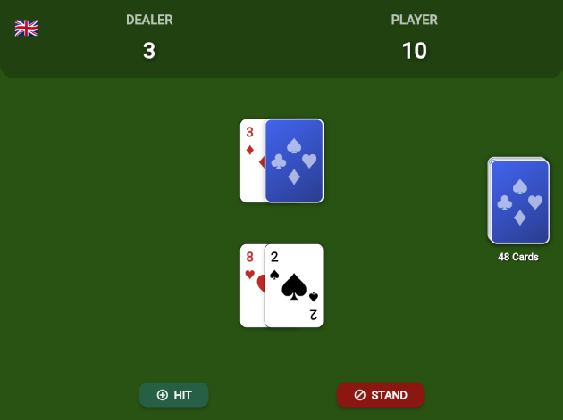

Desenvolver jogos ou aplicativos que simulam jogos de tabuleiro sempre traz desafios interessantes de UI. Recentemente, enquanto criava uma versão do clássico jogo de cartas Blackjack em Flutter, me deparei com a necessidade de um componente de carta de baralho que fosse não apenas funcional, mas também visualmente agradável e, acima de tudo, reutilizável.

Neste post, vou guiar você pelo processo de criação do `PlayingCard`, um widget que renderiza tanto a frente quanto o verso de uma carta, é totalmente customizável em tamanho e foi a peça central do meu [jogo de Blackjack](https://thomazrb.itch.io/flutter-blackjack).

### A Estrutura: Separando Dados da Interface

Antes de desenhar qualquer coisa, o mais importante é modelar os dados. Uma boa arquitetura separa a lógica (o que uma carta *é*) da apresentação (como uma carta *se parece*). Para isso, criei a classe `PlayingCardModel`.

Ela usa `enum` para garantir que naipes e ranks sejam sempre válidos, e contém a lógica para obter a representação em string ('A', 'K', '10') e o valor da carta no jogo de Blackjack.

```dart
/// Define os quatro naipes possíveis de um baralho.
enum CardSuit { hearts, diamonds, clubs, spades }

/// Define os "ranks" (valores/figuras) de uma carta.
enum CardRank {
  ace, two, three, four, five, six, seven, eight, nine, ten, jack, queen, king,
}

/// Representa o modelo de dados de uma única carta de baralho.
class PlayingCardModel {
  final CardSuit suit;
  final CardRank rank;
  bool isFaceUp;

  PlayingCardModel({
    required this.suit,
    required this.rank,
    this.isFaceUp = true,
  });

  /// Retorna a representação em `String` do rank da carta.
  String get rankString {
    switch (rank) {
      case CardRank.ace: return 'A';
      case CardRank.jack: return 'J';
      case CardRank.queen: return 'Q';
      case CardRank.king: return 'K';
      default: return (rank.index + 1).toString();
    }
  }

  /// Retorna o valor numérico da carta para o jogo de Blackjack.
  int get value {
    switch (rank) {
      case CardRank.ace: return 11;
      case CardRank.jack:
      case CardRank.queen:
      case CardRank.king: return 10;
      default: return rank.index + 1;
    }
  }
}
```

### Construindo o Widget `PlayingCard`

Com o modelo pronto, podemos focar na parte visual. O widget `PlayingCard` recebe um `PlayingCardModel` e um parâmetro `size`, que funciona como um multiplicador para escalar a carta inteira, tornando-a incrivelmente flexível para diferentes layouts.

A lógica principal é simples: se `card.isFaceUp` for verdadeiro, mostre a face; senão, mostre o verso.

Aqui está o código completo do widget:

```dart
import 'package:flutter/material.dart';
import 'dart:math' as math;
import '../models/card_model.dart';

class PlayingCard extends StatelessWidget {
  final PlayingCardModel card;
  final double size;

  const PlayingCard({super.key, required this.card, this.size = 1.0});

  // Getter para detalhes visuais do naipe (ícone e cor).
  Map<String, dynamic> get _suitDetails {
    switch (card.suit) {
      case CardSuit.hearts: return {'icon': '♥', 'color': Colors.red[700]!};
      case CardSuit.diamonds: return {'icon': '♦', 'color': Colors.red[700]!};
      case CardSuit.clubs: return {'icon': '♣', 'color': Colors.black};
      case CardSuit.spades: return {'icon': '♠', 'color': Colors.black};
    }
  }

  @override
  Widget build(BuildContext context) {
    return card.isFaceUp ? _buildCardFace() : _buildCardBack();
  }

  /// Constrói a face da carta (rank e naipe).
  Widget _buildCardFace() {
    final details = _suitDetails;
    final String rankText = card.rankString;
    final String suitIcon = details['icon'];
    final Color suitColor = details['color'];

    final cardWidth = 70.0 * size;
    final cardHeight = 100.0 * size;
    final cornerFontSize = 16.0 * size;
    final centerFontSize = 35.0 * size;

    return Container(
      width: cardWidth,
      height: cardHeight,
      decoration: BoxDecoration(
        color: Colors.white,
        borderRadius: BorderRadius.circular(8.0 * size),
        border: Border.all(color: Colors.black, width: 0.5 * size),
        boxShadow: [
          BoxShadow(
            color: Colors.black.withAlpha(51), // ~20% opacidade
            spreadRadius: 1 * size,
            blurRadius: 3 * size,
            offset: Offset(1 * size, 1 * size),
          ),
        ],
      ),
      child: Stack(
        children: [
          // Canto superior esquerdo
          Positioned(
            top: 4 * size,
            left: 5 * size,
            child: _buildCorner(rankText, suitIcon, suitColor, cornerFontSize),
          ),
          // Canto inferior direito (rotacionado)
          Positioned(
            bottom: 4 * size,
            right: 5 * size,
            child: Transform.rotate(
              angle: math.pi,
              child: _buildCorner(
                rankText,
                suitIcon,
                suitColor,
                cornerFontSize,
              ),
            ),
          ),
          // Ícone central
          Center(
            child: Text(
              suitIcon,
              style: TextStyle(fontSize: centerFontSize, color: suitColor),
            ),
          ),
        ],
      ),
    );
  }

  /// Constrói o verso da carta.
  Widget _buildCardBack() {
    final cardWidth = 70.0 * size;
    final cardHeight = 100.0 * size;

    return Container(
      width: cardWidth,
      height: cardHeight,
      decoration: BoxDecoration(
        color: const Color(0xFF1E3A8A), // Azul escuro
        borderRadius: BorderRadius.circular(8.0 * size),
        border: Border.all(color: Colors.white, width: 1.5 * size),
        gradient: LinearGradient(
          colors: [const Color(0xFF2563EB), const Color(0xFF1E3A8A)],
          begin: Alignment.topLeft,
          end: Alignment.bottomRight,
        ),
        boxShadow: [
          BoxShadow(
            color: Colors.black.withAlpha(77), // ~30% opacidade
            spreadRadius: 1 * size,
            blurRadius: 4 * size,
            offset: Offset(1 * size, 1 * size),
          ),
        ],
      ),
      child: Center(child: _buildCircularSuitPattern()),
    );
  }

  /// Cria o padrão circular com os 4 naipes para o verso da carta.
  Widget _buildCircularSuitPattern() {
    final suits = ['♥', '♦', '♣', '♠'];
    final radius = 18.0 * size;
    final iconSize = 19.0 * size;

    return Stack(
      alignment: Alignment.center,
      children: List.generate(suits.length, (index) {
        // Calcula o ângulo para cada naipe (0, 90, 180, 270 graus).
        final angle = index * (math.pi / 2);

        // Usa trigonometria para calcular a posição (x, y) no círculo.
        final x = radius * math.cos(angle);
        final y = radius * math.sin(angle);

        final suitColor = Colors.white.withAlpha(153); // ~60% opacidade

        return Transform.translate(
          offset: Offset(x, y),
          child: Text(
            suits[index],
            style: TextStyle(
              fontSize: iconSize,
              color: suitColor,
              fontWeight: FontWeight.bold,
            ),
          ),
        );
      }),
    );
  }

  /// Constrói o widget do canto da carta (rank e naipe).
  Widget _buildCorner(String rank, String suit, Color color, double fontSize) {
    return Column(
      children: [
        Text(
          rank,
          style: TextStyle(
            fontSize: fontSize,
            fontWeight: FontWeight.bold,
            color: color,
          ),
        ),
        Text(
          suit,
          style: TextStyle(fontSize: fontSize * 0.8, color: color),
        ),
      ],
    );
  }
}
```

### Detalhes da Implementação Visual

Alguns pontos interessantes na construção da UI:

1.  **Cantos Simétricos**: Para criar o clássico visual da carta com o valor nos cantos opostos, eu criei um widget `_buildCorner` e, para o canto inferior direito, simplesmente o rotacionei 180 graus (`math.pi`) com um `Transform.rotate`. Simples e eficaz!
2.  **Verso Estilizado**: Em vez de uma cor sólida, usei um `LinearGradient` para dar profundidade ao verso da carta.
3.  **Padrão de Naipes Trigonométrico**: O detalhe mais legal do verso é o padrão circular com os quatro naipes. Usando um `Stack` e um pouco de trigonometria (`cos` e `sin`), posicionei cada ícone em um círculo perfeito. O `List.generate` cria os 4 ícones, e `Transform.translate` os posiciona com base no ângulo calculado.

### O Resultado em Ação

Para ver o componente `PlayingCard` em um projeto real, nada melhor que um jogo funcional. Criei uma versão web simples de Blackjack que demonstra como as cartas são distribuídas, viradas e organizadas na tela.



Você pode jogar ele diretamente no seu navegador:

**[Jogue Flutter Blackjack aqui!](https://thomazrb.itch.io/flutter-blackjack)**

### Conclusão e Código Fonte

Criar componentes de UI do zero no Flutter é um exercício extremamente recompensador. Com o `PlayingCard`, temos um widget flexível, com uma API limpa e um visual caprichado, pronto para ser usado em qualquer jogo de cartas.

Se você quer explorar o código completo do jogo de Blackjack para ver como o `PlayingCard` foi integrado, ou simplesmente usar o componente em seus próprios projetos, o repositório está aberto no GitHub.

**[Acesse o repositório completo no GitHub aqui!](https://github.com/thomazrb/flutter_blackjack)**

Fique à vontade para clonar, abrir issues, sugerir melhorias ou dar uma estrela se o projeto foi útil para você!
