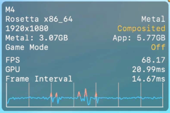

The Metal HUD is a macOS overlay that displays real-time GPU metrics: FPS, video memory usage, frame time. It appears directly on top of any Metal app. Useful for monitoring performance in games and graphics applications.



### Enable

```console
/bin/launchctl setenv MTL_HUD_ENABLED 1
```

Open (or reopen) the app after running the command. The HUD appears in the corner of the screen.

### Disable

```console
/bin/launchctl unsetenv MTL_HUD_ENABLED
```

Close and reopen the app for the HUD to disappear.

### Notes

- The command affects the entire system environment: any Metal app launched afterwards will show the HUD.
- No macOS restart needed, only the target app.
- Works on macOS Ventura and later (and on earlier versions too).
