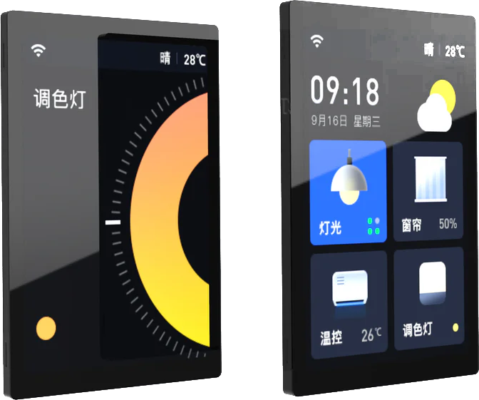

Para quem desenvolve projetos com interfaces gráficas, a complexidade de integrar displays, controladores de toque e microcontroladores pode ser um grande desafio. A placa **WT32-SC01 Plus** surge como uma alternativa interessante para simplificar esse processo.

Trata-se de uma placa de desenvolvimento que integra o processador ESP32-S3 a uma tela de 3.5 polegadas com toque capacitivo. Essa abordagem "tudo em um" é ideal para a prototipagem e desenvolvimento de interfaces de usuário (UI), como painéis de controle para automação, pequenos consoles interativos e outros dispositivos que exigem uma interação visual com o usuário.

Nesta série de 6 posts, vamos explorar o potencial desta placa, desde a configuração inicial até a criação de interfaces complexas e funcionais. Este primeiro artigo é o nosso ponto de partida: vamos conhecer o hardware, entender suas características e preparar o terreno para nossos futuros projetos.

### Uma Abordagem Integrada

A principal característica da WT32-SC01 Plus é a sua natureza integrada. Ao contrário da montagem tradicional, que exige a compra e conexão separada de um ESP32, display e controlador de toque, esta placa já une todos os componentes. Isso agiliza o desenvolvimento e reduz significativamente as chances de erros de conexão ou compatibilidade de hardware.

### Principais Características Técnicas

Vamos dar uma olhada nas especificações da placa:

* **Processador:** **ESP32-S3** Dual-Core Xtensa LX7. Um chip moderno e poderoso com Wi-Fi, Bluetooth 5 (LE), aceleração de IA e baixo consumo de energia.
* **Display:** Tela de **3.5 polegadas** com resolução de **480x320 pixels**. A comunicação é feita via uma **interface paralela de 8 bits**, que é significativamente mais rápida que a comunicação SPI comum, resultando em animações mais fluidas.
* **Toque:** Controlador de toque **capacitivo FT6336U**. É o mesmo tipo de tecnologia encontrada em smartphones, oferecendo uma resposta ao toque muito mais precisa e suave do que os antigos painéis resistivos.
* **Memória:** Vem equipada com 16MB de Flash e 8MB de PSRAM, essencial para armazenar imagens, fontes e para o bom funcionamento de bibliotecas gráficas como a LVGL.
* **Conectividade:** Além do Wi-Fi e Bluetooth, a placa possui um conector USB-C para programação e alimentação, um slot para cartão MicroSD para armazenamento expansível e conectores para expansão de GPIOs.
* **Áudio:** Inclui um amplificador de áudio e um conector para alto-falante, permitindo a reprodução de sons e alertas sonoros diretamente na placa.

### Pontos a Considerar

1.  **Desenvolvimento Acelerado:** Por ser uma solução integrada, o tempo entre tirar a placa da caixa e começar a programar a interface é mínimo. A complexidade do hardware já foi resolvida.
2.  **Custo Efetivo:** Para muitos projetos, adquirir a placa integrada pode ser mais econômico do que comprar os componentes de alta qualidade separadamente.
3.  **Otimizada para Interfaces Gráficas:** A arquitetura da placa, com seu processador rápido, interface de display paralela e PSRAM, é especialmente adequada para bibliotecas gráficas como a **LVGL**, permitindo a criação de interfaces fluidas e responsivas, principalmente quando combinada com ferramentas como o **SquareLine Studio**.

### Onde Encontrar?

A placa está disponível em diversas lojas online. Para referência, aqui está o comprador no AliExpress na qual adquiri a minha (cuidado para não comprar a ferramenta de debug nem a versão antiga, a placa é a WT32-SC01 PLUS):

* [**Link de Compra - WT32-SC01 Plus no AliExpress**](https://s.click.aliexpress.com/e/_oCKjXXt)

### Próximos Passos

Agora que conhecemos o hardware, estamos prontos para colocar a mão na massa. No próximo post desta série, vamos configurar nosso ambiente de desenvolvimento, instalar as bibliotecas necessárias e escrever nosso primeiro código: o clássico "Hello World!" aparecerá em nossa tela.

Até lá!